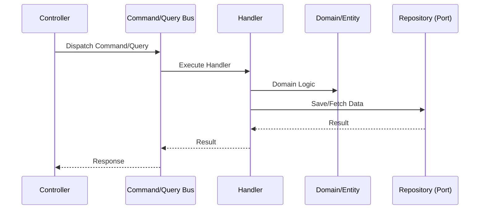

<p align="center">
  <a href="http://nestjs.com/" target="blank"></a>
</p>

# Hexagonal Architecture & CQRS NestJS Starter

A premium, production-ready NestJS starter kit implementing **Hexagonal Architecture** (Ports & Adapters) and **CQRS** (Command Query Responsibility Segregation).

---

## 🏛️ Architecture Overview

This project is built on the principles of **Domain-Driven Design (DDD)** and **Clean Architecture**. It decouples the core business logic from external concerns like databases, APIs, and third-party services.

### Hexagonal Layers (Ports & Adapters)

```mermaid
graph TD
    subgraph "External World (Adapters)"
        PC[Presentation: Controllers]
        IA[Infrastructure: TypeORM/Persistence]
    </subgraph>

    subgraph "Application Core"
        AL[Application Logic]
        P[Ports: Interfaces]
    end

    subgraph "Domain Layer"
        DE[Domain Entities]
        DS[Domain Services]
    end

    PC --> AL
    AL --> P
    IA -.-> |implements| P
    AL --> DE
```

### CQRS Flow (Read/Write Separation)



---

## 📂 Project Structure

The project is organized to maintain a clear separation of concerns:

```text
src/
├── shared/           # Shared utilities, CQRS core components
└── user/             # Feature module (User)
    ├── application/  # Business orchestration logic
    │   ├── commands/ # Write operations
    │   ├── queries/  # Read operations
    │   ├── handlers/ # Logic to process commands/queries
    │   └── ports/    # Interfaces for external dependencies
    ├── domain/       # Core business logic (Entities, Value Objects)
    ├── infrastructure/ # External implementations (Adapters)
    │   └── adapaters/# TypeORM repositories, entities
    └── presentation/ # Entry points (Controllers, GraphQL, etc.)
```

---

## 🚀 Getting Started

### Prerequisites
- Node.js (v16+)
- Docker & Docker Compose

### Setup

```bash
# Install dependencies
$ npm install

# Copy environment variables
$ cp .env.example .env

# Start infrastructure (PostgreSQL)
$ docker-compose up -d
```

### Running the App

```bash
# development
$ npm run start

# watch mode
$ npm run start:dev
```

---

## 🧪 Testing

```bash
# unit tests
$ npm run test

# e2e tests
$ npm run test:e2e

# test coverage
$ npm run test:cov
```

---

## 🛠️ Key Features

- **Decoupled Persistence**: Easily swap TypeORM for MongoDB or any other DB by implementing a new adapter.
- **Explicit Intent**: Commands and Queries clearly define what the system can do.
- **Domain-Centric**: Business rules are isolated within the domain layer.
- **Type Safety**: Full TypeScript implementation with strict typing.

---

## License

This project is [MIT licensed](LICENSE).
